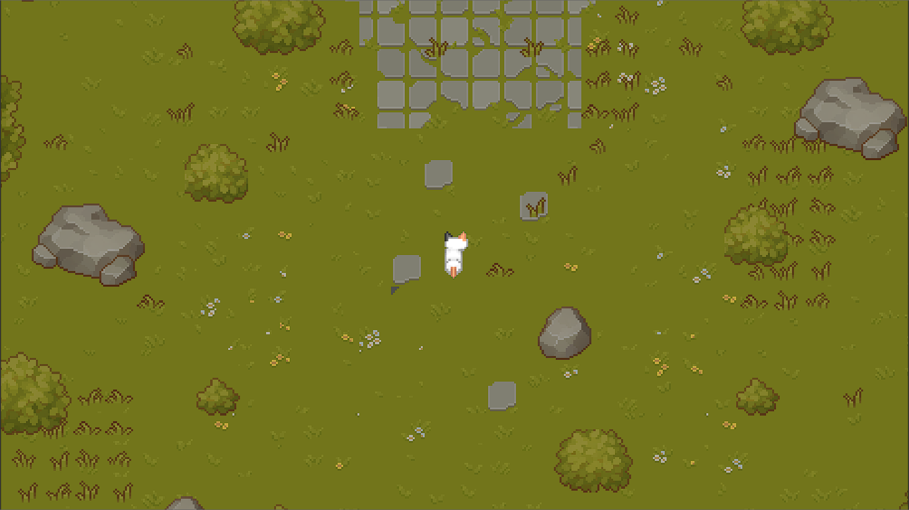
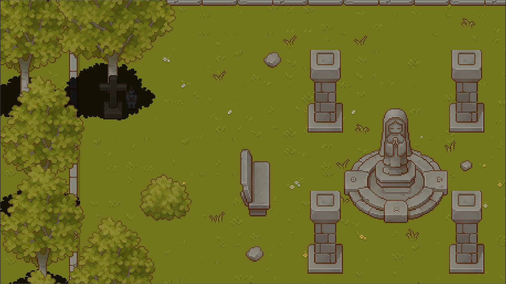

# Ola-meu-caro-amigo
Jogo desenvolvido para a disciplina de Computação gráfica

O “jogo” foi feito utilizando a engine godot na versão 4.1.3. A escolha dessa engine foi devido ao fato dela ser uma boa engine para games em pixel art e é muito fácil de utilizar.
Ola, meu caro amigo é uma experiência audiovisual sobre um gato em um bosque indo visitar uma lápide. O jogador deve apenas apreciar o cenário e música, uma vez que não tem um objetivo pode ser contraditório chamá-lo de jogo. 
A mensagem que o jogo quer passar é subjetiva para cada pessoa, aprecie a obra com calma e reflita sobre oque vier à mente.

## Jogabilidade
O jogo começa com o gato no meio do bosque, o jogador pode usar as teclas AWSD ou as setas do teclado para se movimentar, além disso ao apertar SPACE o gato mia. (OBS: O player só consegue se mover 1 direção por vez)
A única interação que há no game é quando perto da lápide o gato pode se deitar, ao apertar F, ao deitar-se não pode mais se movimentar até apertar F mais uma vez e o gato levantar
Além disso o jogador é livre para se movimentar pelo cenário sem nenhum objetivo

## Trilha Sonora
A trilha sonora escolhida foi a moonlight sonata 1st movement de Beethoven, junto com um efeito de vento. Ambas as trilhas funcionam em conjunto e começam assim que começa o jogo.

## Créditos de assets e músicas utilizadas
[Sprites Gato](https://pop-shop-packs.itch.io/cats-pixel-asset-pack) 
[Cenário](https://cainos.itch.io/pixel-art-top-down-basic) 
[Efeito sonoro vento](https://www.youtube.com/watch?v=Q-ewbdi0Hxc) 
[moonlight sonata 1st movement de Beethoven](https://www.youtube.com/watch?v=sbTVZMJ9Z2I) 
[Som meow](https://www.youtube.com/watch?v=uLB1ZeRgl_k) 
